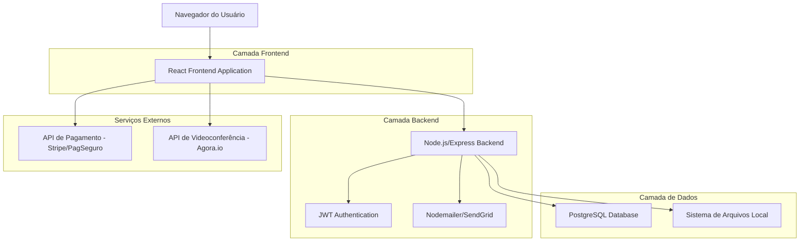
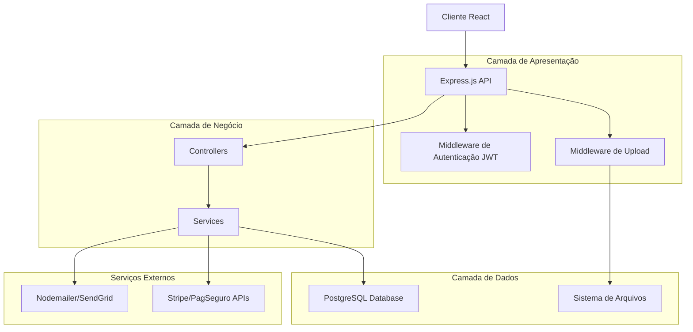
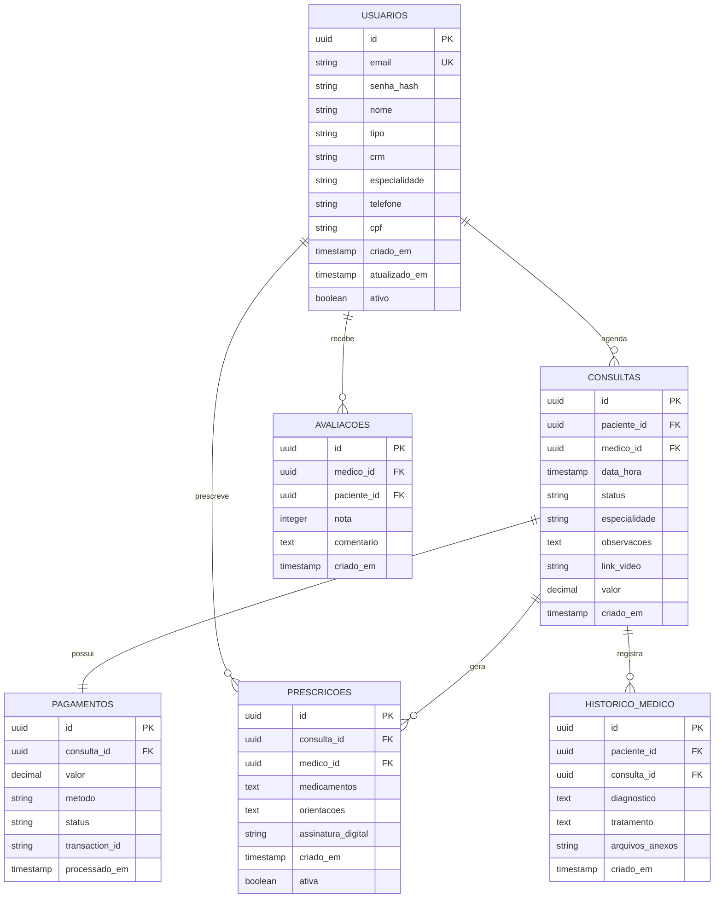

# Documentação de Arquitetura Técnica - Sistema de Telemedicina

## 1. Design da Arquitetura



## 2. Descrição das Tecnologias

- **Frontend**: React@18 + TypeScript + Tailwind CSS + Vite + React Router
- **Backend**: Node.js + Express.js + TypeScript
- **Banco de Dados**: PostgreSQL (no VPS do usuário)
- **ORM**: Prisma ou TypeORM para gerenciamento do banco
- **Autenticação**: JWT (JSON Web Tokens) customizada
- **Armazenamento**: Sistema de arquivos local + Multer para uploads
- **Videoconferência**: Agora.io SDK para chamadas de vídeo
- **Pagamentos**: Stripe + PagSeguro para processamento
- **Email**: Nodemailer ou SendGrid para notificações
- **Validação**: Joi ou Zod para validação de dados
- **Segurança**: bcrypt para hash de senhas, helmet para segurança HTTP

## 3. Definições de Rotas

| Rota | Propósito |
|------|----------|
| / | Página inicial com apresentação do serviço |
| /login | Página de autenticação de usuários |
| /cadastro | Registro de novos pacientes e médicos |
| /dashboard | Dashboard principal (paciente ou médico) |
| /agendamento | Interface de agendamento de consultas |
| /consulta/:id | Sala de videoconferência para consultas |
| /perfil | Gerenciamento de perfil do usuário |
| /historico | Histórico médico e consultas anteriores |
| /prescricoes | Visualização e criação de prescrições |
| /pagamentos | Processamento e histórico de pagamentos |
| /admin | Painel administrativo (apenas admins) |

## 4. Definições de API

### 4.1 APIs Principais

**Autenticação de usuários (JWT)**
```
POST /api/auth/login
```

Request:
| Nome do Parâmetro | Tipo | Obrigatório | Descrição |
|-------------------|------|-------------|----------|
| email | string | true | Email do usuário |
| password | string | true | Senha do usuário |

Response:
| Nome do Parâmetro | Tipo | Descrição |
|-------------------|------|-----------|
| success | boolean | Status da operação |
| token | string | JWT token para autenticação |
| user | object | Dados do usuário autenticado |
| expiresIn | string | Tempo de expiração do token |

Exemplo:
```json
{
  "success": true,
  "token": "eyJhbGciOiJIUzI1NiIsInR5cCI6IkpXVCJ9...",
  "user": {
    "id": "uuid-do-usuario",
    "email": "medico@exemplo.com",
    "nome": "Dr. João Silva",
    "tipo": "medico"
  },
  "expiresIn": "24h"
}
```

**APIs REST Customizadas:**
- `GET /api/usuarios` - Listar usuários
- `POST /api/usuarios` - Criar usuário
- `GET /api/consultas` - Listar consultas
- `POST /api/consultas` - Criar consulta
- `GET /api/prescricoes` - Listar prescrições
- `POST /api/prescricoes` - Criar prescrição

**Agendamento de consultas (API REST)**
```
POST /api/consultas
```

Request:
| Nome do Parâmetro | Tipo | Obrigatório | Descrição |
|-------------------|------|-------------|----------|
| medico_id | string | true | UUID do médico |
| data_hora | string | true | Data e hora da consulta (ISO 8601) |
| especialidade | string | true | Especialidade médica |
| observacoes | string | false | Observações do paciente |
| valor | number | true | Valor da consulta |

Response:
| Nome do Parâmetro | Tipo | Descrição |
|-------------------|------|-----------|
| success | boolean | Status da operação |
| data | object | Dados da consulta criada |
| message | string | Mensagem de confirmação |

Exemplo:
```json
{
  "success": true,
  "data": {
    "id": "uuid-da-consulta",
    "medico_id": "uuid-do-medico",
    "paciente_id": "uuid-do-paciente",
    "data_hora": "2024-01-15T14:00:00Z",
    "especialidade": "Cardiologia",
    "status": "agendada",
    "valor": 150.00
  },
  "message": "Consulta agendada com sucesso"
}
```

**Criação de prescrições (API REST)**
```
POST /api/prescricoes
```

Request:
| Nome do Parâmetro | Tipo | Obrigatório | Descrição |
|-------------------|------|-------------|----------|
| consulta_id | string | true | UUID da consulta |
| medicamentos | array | true | Lista de medicamentos prescritos |
| orientacoes | string | false | Orientações médicas |
| assinatura_digital | string | true | Hash da assinatura digital |

Exemplo de Request:
```json
{
  "consulta_id": "uuid-da-consulta",
  "medicamentos": [{
    "nome": "Losartana 50mg",
    "dosagem": "1 comprimido ao dia",
    "duracao": "30 dias"
  }],
  "orientacoes": "Tomar em jejum",
  "assinatura_digital": "hash-da-assinatura"
}
```

**Processamento de pagamentos (API REST)**
```
POST /api/pagamentos
```

Request:
| Nome do Parâmetro | Tipo | Obrigatório | Descrição |
|-------------------|------|-------------|----------|
| consulta_id | string | true | UUID da consulta |
| metodo | string | true | Método de pagamento (cartao, pix, boleto) |
| dados_pagamento | object | true | Dados específicos do método de pagamento |

Exemplo de Request:
```json
{
  "consulta_id": "uuid-da-consulta",
  "metodo": "cartao",
  "dados_pagamento": {
    "numero": "**** **** **** 1234",
    "cvv": "123",
    "validade": "12/25",
    "nome": "João Silva"
  }
}
```

Response:
| Nome do Parâmetro | Tipo | Descrição |
|-------------------|------|-----------|
| success | boolean | Status da operação |
| transaction_id | string | ID da transação |
| status | string | Status do pagamento |
| message | string | Mensagem de confirmação |

## 5. Arquitetura do Servidor



## 6. Modelo de Dados

### 6.1 Definição do Modelo de Dados



### 6.2 Linguagem de Definição de Dados (PostgreSQL)

**Configuração de Conexão com PostgreSQL**
```javascript
// config/database.js
const { Pool } = require('pg');

const pool = new Pool({
  user: process.env.DB_USER || 'postgres',
  host: process.env.DB_HOST || 'localhost', // IP do VPS
  database: process.env.DB_NAME || 'telemedicina',
  password: process.env.DB_PASSWORD,
  port: process.env.DB_PORT || 5432,
  ssl: process.env.NODE_ENV === 'production' ? { rejectUnauthorized: false } : false
});

module.exports = pool;
```

**Tabela de Usuários (usuarios)**
```sql
-- Criar extensão para UUID (se não existir)
CREATE EXTENSION IF NOT EXISTS "uuid-ossp";

-- Criar tabela de usuários
CREATE TABLE usuarios (
    id UUID PRIMARY KEY DEFAULT uuid_generate_v4(),
    email VARCHAR(255) UNIQUE NOT NULL,
    senha_hash VARCHAR(255) NOT NULL,
    nome VARCHAR(100) NOT NULL,
    tipo VARCHAR(20) NOT NULL CHECK (tipo IN ('paciente', 'medico', 'admin')),
    crm VARCHAR(20),
    especialidade VARCHAR(100),
    telefone VARCHAR(20),
    cpf VARCHAR(14),
    criado_em TIMESTAMP WITH TIME ZONE DEFAULT NOW(),
    atualizado_em TIMESTAMP WITH TIME ZONE DEFAULT NOW(),
    ativo BOOLEAN DEFAULT true
);

-- Criar índices para performance
CREATE INDEX idx_usuarios_email ON usuarios(email);
CREATE INDEX idx_usuarios_tipo ON usuarios(tipo);
CREATE INDEX idx_usuarios_crm ON usuarios(crm) WHERE crm IS NOT NULL;
CREATE INDEX idx_usuarios_ativo ON usuarios(ativo);

-- Trigger para atualizar campo atualizado_em automaticamente
CREATE OR REPLACE FUNCTION update_updated_at_column()
RETURNS TRIGGER AS $$
BEGIN
    NEW.atualizado_em = NOW();
    RETURN NEW;
END;
$$ language 'plpgsql';

CREATE TRIGGER update_usuarios_updated_at BEFORE UPDATE
    ON usuarios FOR EACH ROW EXECUTE FUNCTION update_updated_at_column();
```

**Tabela de Consultas (consultas)**
```sql
-- Criar tabela de consultas
CREATE TABLE consultas (
    id UUID PRIMARY KEY DEFAULT uuid_generate_v4(),
    paciente_id UUID NOT NULL REFERENCES usuarios(id) ON DELETE CASCADE,
    medico_id UUID NOT NULL REFERENCES usuarios(id) ON DELETE CASCADE,
    data_hora TIMESTAMP WITH TIME ZONE NOT NULL,
    status VARCHAR(20) DEFAULT 'agendada' CHECK (status IN ('agendada', 'em_andamento', 'finalizada', 'cancelada')),
    especialidade VARCHAR(100) NOT NULL,
    observacoes TEXT,
    link_video VARCHAR(500),
    valor DECIMAL(10,2) NOT NULL,
    criado_em TIMESTAMP WITH TIME ZONE DEFAULT NOW()
);

-- Criar índices para performance
CREATE INDEX idx_consultas_paciente ON consultas(paciente_id);
CREATE INDEX idx_consultas_medico ON consultas(medico_id);
CREATE INDEX idx_consultas_data ON consultas(data_hora);
CREATE INDEX idx_consultas_status ON consultas(status);
CREATE INDEX idx_consultas_data_status ON consultas(data_hora, status);

-- Constraint para evitar conflitos de horário do mesmo médico
CREATE UNIQUE INDEX idx_consultas_medico_horario 
    ON consultas(medico_id, data_hora) 
    WHERE status IN ('agendada', 'em_andamento');
```

**Tabela de Prescrições (prescricoes)**
```sql
-- Criar tabela de prescrições
CREATE TABLE prescricoes (
    id UUID PRIMARY KEY DEFAULT uuid_generate_v4(),
    consulta_id UUID NOT NULL REFERENCES consultas(id) ON DELETE CASCADE,
    medico_id UUID NOT NULL REFERENCES usuarios(id) ON DELETE CASCADE,
    medicamentos JSONB NOT NULL,
    orientacoes TEXT,
    assinatura_digital VARCHAR(500) NOT NULL,
    criado_em TIMESTAMP WITH TIME ZONE DEFAULT NOW(),
    ativa BOOLEAN DEFAULT true
);

-- Criar índices
CREATE INDEX idx_prescricoes_consulta ON prescricoes(consulta_id);
CREATE INDEX idx_prescricoes_medico ON prescricoes(medico_id);
CREATE INDEX idx_prescricoes_ativa ON prescricoes(ativa);
```

**Tabela de Pagamentos (pagamentos)**
```sql
-- Criar tabela de pagamentos
CREATE TABLE pagamentos (
    id UUID PRIMARY KEY DEFAULT uuid_generate_v4(),
    consulta_id UUID NOT NULL REFERENCES consultas(id) ON DELETE CASCADE,
    valor DECIMAL(10,2) NOT NULL,
    metodo VARCHAR(20) NOT NULL CHECK (metodo IN ('cartao', 'pix', 'boleto')),
    status VARCHAR(20) DEFAULT 'pendente' CHECK (status IN ('pendente', 'aprovado', 'rejeitado', 'estornado')),
    transaction_id VARCHAR(100),
    processado_em TIMESTAMP WITH TIME ZONE DEFAULT NOW()
);

-- Criar índices
CREATE INDEX idx_pagamentos_consulta ON pagamentos(consulta_id);
CREATE INDEX idx_pagamentos_status ON pagamentos(status);
CREATE INDEX idx_pagamentos_transaction ON pagamentos(transaction_id);
```

**Tabelas Complementares**
```sql
-- Criar tabela de avaliações
CREATE TABLE avaliacoes (
    id UUID PRIMARY KEY DEFAULT uuid_generate_v4(),
    medico_id UUID NOT NULL REFERENCES usuarios(id) ON DELETE CASCADE,
    paciente_id UUID NOT NULL REFERENCES usuarios(id) ON DELETE CASCADE,
    consulta_id UUID REFERENCES consultas(id) ON DELETE SET NULL,
    nota INTEGER NOT NULL CHECK (nota >= 1 AND nota <= 5),
    comentario TEXT,
    criado_em TIMESTAMP WITH TIME ZONE DEFAULT NOW()
);

-- Criar tabela de histórico médico
CREATE TABLE historico_medico (
    id UUID PRIMARY KEY DEFAULT uuid_generate_v4(),
    paciente_id UUID NOT NULL REFERENCES usuarios(id) ON DELETE CASCADE,
    consulta_id UUID REFERENCES consultas(id) ON DELETE SET NULL,
    diagnostico TEXT,
    tratamento TEXT,
    arquivos_anexos TEXT[], -- Array de caminhos dos arquivos
    criado_em TIMESTAMP WITH TIME ZONE DEFAULT NOW()
);

-- Índices para as tabelas complementares
CREATE INDEX idx_avaliacoes_medico ON avaliacoes(medico_id);
CREATE INDEX idx_avaliacoes_paciente ON avaliacoes(paciente_id);
CREATE INDEX idx_avaliacoes_nota ON avaliacoes(nota);
CREATE INDEX idx_historico_paciente ON historico_medico(paciente_id);
CREATE INDEX idx_historico_consulta ON historico_medico(consulta_id);
```

**Script de Migração Completo**
```sql
-- Script para criar o banco de dados completo
-- Execute este script no PostgreSQL do seu VPS

-- 1. Criar banco de dados (execute como superuser)
CREATE DATABASE telemedicina;
\c telemedicina;

-- 2. Criar extensões necessárias
CREATE EXTENSION IF NOT EXISTS "uuid-ossp";

-- 3. Executar todos os scripts de criação de tabelas acima
-- (usuarios, consultas, prescricoes, pagamentos, avaliacoes, historico_medico)

-- 4. Inserir dados iniciais
INSERT INTO usuarios (email, senha_hash, nome, tipo) VALUES 
('admin@telemedicina.com', '$2b$10$exemplo_hash', 'Administrador', 'admin');

-- 5. Configurar permissões de usuário da aplicação
CREATE USER app_telemedicina WITH PASSWORD 'senha_segura';
GRANT CONNECT ON DATABASE telemedicina TO app_telemedicina;
GRANT USAGE ON SCHEMA public TO app_telemedicina;
GRANT SELECT, INSERT, UPDATE, DELETE ON ALL TABLES IN SCHEMA public TO app_telemedicina;
GRANT USAGE, SELECT ON ALL SEQUENCES IN SCHEMA public TO app_telemedicina;
```

**Configuração de Segurança da Aplicação**
```javascript
// middleware/auth.js - Middleware de autenticação JWT
const jwt = require('jsonwebtoken');
const pool = require('../config/database');

const authenticateToken = async (req, res, next) => {
  const authHeader = req.headers['authorization'];
  const token = authHeader && authHeader.split(' ')[1];

  if (!token) {
    return res.status(401).json({ error: 'Token de acesso requerido' });
  }

  try {
    const decoded = jwt.verify(token, process.env.JWT_SECRET);
    
    // Buscar dados atualizados do usuário
    const result = await pool.query(
      'SELECT id, email, nome, tipo, ativo FROM usuarios WHERE id = $1 AND ativo = true',
      [decoded.userId]
    );

    if (result.rows.length === 0) {
      return res.status(401).json({ error: 'Usuário não encontrado ou inativo' });
    }

    req.user = result.rows[0];
    next();
  } catch (error) {
    return res.status(403).json({ error: 'Token inválido' });
  }
};

// Middleware para verificar tipo de usuário
const requireRole = (roles) => {
  return (req, res, next) => {
    if (!roles.includes(req.user.tipo)) {
      return res.status(403).json({ error: 'Acesso negado' });
    }
    next();
  };
};

module.exports = { authenticateToken, requireRole };
```