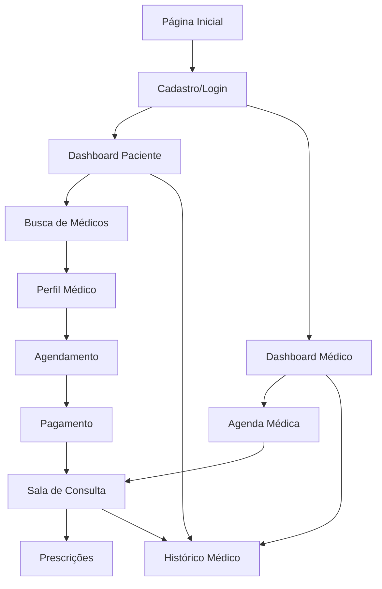

# Documento de Requisitos do Produto - Sistema de Telemedicina

## 1. Visão Geral do Produto
Sistema web completo para consultas médicas por telemedicina, conectando pacientes e médicos através de uma plataforma digital segura e integrada.

O sistema resolve a necessidade de acesso remoto a cuidados médicos, permitindo consultas online, gerenciamento de histórico médico e prescrições digitais. Destinado a pacientes que buscam conveniência e médicos que desejam expandir seu atendimento.

Objetivo: Democratizar o acesso à saúde através da tecnologia, criando um mercado digital de consultas médicas com potencial de escala nacional.

## 2. Funcionalidades Principais

### 2.1 Papéis de Usuário
| Papel | Método de Cadastro | Permissões Principais |
|-------|-------------------|----------------------|
| Paciente | Email e CPF | Agendar consultas, visualizar histórico, receber prescrições |
| Médico | CRM + validação profissional | Realizar consultas, prescrever medicamentos, gerenciar agenda |
| Administrador | Convite interno | Gerenciar usuários, relatórios, configurações do sistema |

### 2.2 Módulos Funcionais
Nosso sistema de telemedicina consiste nas seguintes páginas principais:
1. **Página Inicial**: apresentação do serviço, login/cadastro, busca de especialidades.
2. **Dashboard do Paciente**: agendamentos, histórico de consultas, prescrições ativas.
3. **Dashboard do Médico**: agenda, lista de pacientes, ferramentas de consulta.
4. **Sala de Consulta**: videoconferência, chat, compartilhamento de arquivos.
5. **Agendamento**: calendário, seleção de médicos, confirmação de horários.
6. **Perfil Médico**: informações profissionais, especialidades, avaliações.
7. **Histórico Médico**: prontuário digital, exames, prescrições anteriores.
8. **Prescrições**: criação, assinatura digital, envio para farmácias.
9. **Pagamentos**: processamento de consultas, histórico financeiro.
10. **Administração**: gestão de usuários, relatórios, configurações.

### 2.3 Detalhes das Páginas
| Nome da Página | Nome do Módulo | Descrição da Funcionalidade |
|----------------|----------------|-----------------------------|
| Página Inicial | Hero Section | Apresentar serviços, depoimentos, botões de ação para cadastro |
| Página Inicial | Busca de Especialidades | Filtrar médicos por especialidade, localização, disponibilidade |
| Dashboard Paciente | Próximas Consultas | Exibir agendamentos confirmados, botões para entrar na sala |
| Dashboard Paciente | Histórico Médico | Listar consultas anteriores, prescrições, exames anexados |
| Dashboard Médico | Agenda Médica | Visualizar horários disponíveis, consultas agendadas, bloqueios |
| Dashboard Médico | Lista de Pacientes | Acessar prontuários, histórico de atendimentos |
| Sala de Consulta | Videoconferência | Chamada de vídeo HD, controles de áudio/vídeo, gravação |
| Sala de Consulta | Chat Médico | Mensagens em tempo real, compartilhamento de arquivos |
| Agendamento | Seleção de Médico | Filtros por especialidade, avaliações, preços, disponibilidade |
| Agendamento | Calendário | Visualizar horários livres, selecionar data/hora preferida |
| Perfil Médico | Informações Profissionais | CRM, especialidades, formação, experiência |
| Perfil Médico | Sistema de Avaliações | Comentários de pacientes, classificação por estrelas |
| Histórico Médico | Prontuário Digital | Registros médicos, diagnósticos, tratamentos anteriores |
| Histórico Médico | Anexos de Exames | Upload e visualização de imagens, PDFs, resultados |
| Prescrições | Editor de Receitas | Criar prescrições digitais, banco de medicamentos |
| Prescrições | Assinatura Digital | Validação com certificado digital, envio seguro |
| Pagamentos | Processamento | Integração com gateways, PIX, cartão, boleto |
| Pagamentos | Histórico Financeiro | Relatórios de consultas, comissões, repasses |
| Administração | Gestão de Usuários | Aprovar médicos, suspender contas, relatórios de uso |

## 3. Processo Principal

### Fluxo do Paciente
1. Cadastro/Login na plataforma
2. Busca por especialidade médica desejada
3. Seleção do médico baseada em perfil e disponibilidade
4. Agendamento da consulta com pagamento
5. Acesso à sala de consulta no horário marcado
6. Realização da videochamada com o médico
7. Recebimento de prescrição digital (se necessário)
8. Avaliação do atendimento

### Fluxo do Médico
1. Cadastro com validação de CRM
2. Configuração de perfil profissional e agenda
3. Definição de horários disponíveis e preços
4. Recebimento de notificações de agendamentos
5. Acesso à sala de consulta para atendimento
6. Consulta do histórico do paciente
7. Criação de prescrição digital
8. Finalização da consulta com anotações

## 4. Design da Interface do Usuário

### 4.1 Estilo de Design
- **Cores Primárias**: Azul médico (#2563EB), Verde saúde (#059669)
- **Cores Secundárias**: Branco (#FFFFFF), Cinza claro (#F8FAFC)
- **Estilo de Botões**: Arredondados com sombra sutil, efeito hover suave
- **Fontes**: Inter para textos gerais (16px), Poppins para títulos (24px+)
- **Layout**: Design limpo baseado em cards, navegação superior fixa
- **Ícones**: Estilo outline minimalista, ícones médicos específicos

### 4.2 Visão Geral do Design das Páginas
| Nome da Página | Nome do Módulo | Elementos da UI |
|----------------|----------------|----------------|
| Página Inicial | Hero Section | Banner full-width com gradiente azul, CTA destacado, imagens de médicos |
| Dashboard Paciente | Cards de Consulta | Layout em grid 2x2, cards brancos com sombra, status colorido |
| Sala de Consulta | Interface de Vídeo | Tela dividida 70/30, controles flutuantes, chat lateral |
| Agendamento | Calendário | Componente de calendário interativo, slots de tempo em grid |
| Perfil Médico | Card de Informações | Foto circular, badges de especialidade, sistema de estrelas |
| Prescrições | Editor de Texto | Interface similar a editor de texto, campos estruturados |
| Pagamentos | Formulário | Layout em etapas, indicador de progresso, ícones de pagamento |

### 4.3 Responsividade
Sistema mobile-first com adaptação completa para desktop. Otimização para touch em tablets e smartphones, com navegação por gestos na sala de consulta e interface simplificada para dispositivos móveis.